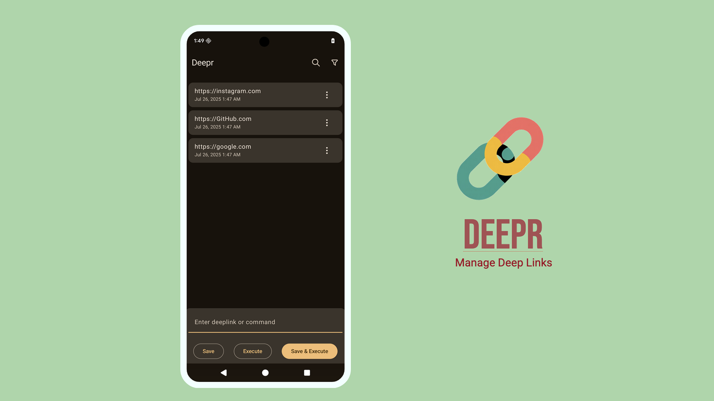

# Deepr 🔗

Deepr is a native Android application designed to streamline the management and testing of deeplinks. It provides a simple and efficient way to store, organize, and launch deeplinks, making it an essential tool for developers and testers.

[](https://github.com/yogeshpaliyal/Deepr/releases/latest)
[](https://github.com/yogeshpaliyal/KeyPass/releases/download/latest-master/app-debug.apk)
[](http://androidweekly.net/issues/issue-685)    
[](https://bsky.app/profile/yogeshpaliyal.com)
[](https://twitter.com/intent/follow?screen_name=yogeshpaliyal)




## Download
You can download the latest version of the application from the [releases page](https://github.com/yogeshpaliyal/Deepr/releases).

## Features

- Save and Organize Deeplinks
- Launch Deeplinks
- Search
- Sort
- Open Counter
- Home Screen Shortcuts

## Architecture

The application is built using modern Android development practices and libraries:

- **UI:** Jetpack Compose
- **Navigation:** Jetpack Compose Navigation 3
- **ViewModel:** Android ViewModel
- **Database:** SQLDelight
- **Dependency Injection:** Koin
- **Asynchronous Operations:** Kotlin Coroutines

## ✍️ Author

👤 **Yogesh Choudhary Paliyal**

* Twitter: <a href="https://twitter.com/yogeshpaliyal" target="_blank">@yogeshpaliyal</a>
* Email: yogeshpaliyal.foss@gmail.com

Feel free to ping me 😉

## 🤝 Contributing

Contributions are what make the open-source community such an amazing place to learn, inspire, and create. Any
contributions you make are **greatly appreciated**.

1. Open an issue first to discuss what you would like to change.
1. Fork the Project
1. Create your feature branch (`git checkout -b feature/amazing-feature`)
1. Commit your changes (`git commit -m 'Add some amazing feature'`)
1. Push to the branch (`git push origin feature/amazing-feature`)
1. Open a pull request

Please make sure to update tests as appropriate.

## 📝 License

```
MIT License

Copyright (c) 2021 Yogesh Choudhary Paliyal

Permission is hereby granted, free of charge, to any person obtaining a copy
of this software and associated documentation files (the "Software"), to deal
in the Software without restriction, including without limitation the rights
to use, copy, modify, merge, publish, distribute, sublicense, and/or sell
copies of the Software, and to permit persons to whom the Software is
furnished to do so, subject to the following conditions:

The above copyright notice and this permission notice shall be included in all
copies or substantial portions of the Software.

THE SOFTWARE IS PROVIDED "AS IS", WITHOUT WARRANTY OF ANY KIND, EXPRESS OR
IMPLIED, INCLUDING BUT NOT LIMITED TO THE WARRANTIES OF MERCHANTABILITY,
FITNESS FOR A PARTICULAR PURPOSE AND NONINFRINGEMENT. IN NO EVENT SHALL THE
AUTHORS OR COPYRIGHT HOLDERS BE LIABLE FOR ANY CLAIM, DAMAGES OR OTHER
LIABILITY, WHETHER IN AN ACTION OF CONTRACT, TORT OR OTHERWISE, ARISING FROM,
OUT OF OR IN CONNECTION WITH THE SOFTWARE OR THE USE OR OTHER DEALINGS IN THE
SOFTWARE.
```
