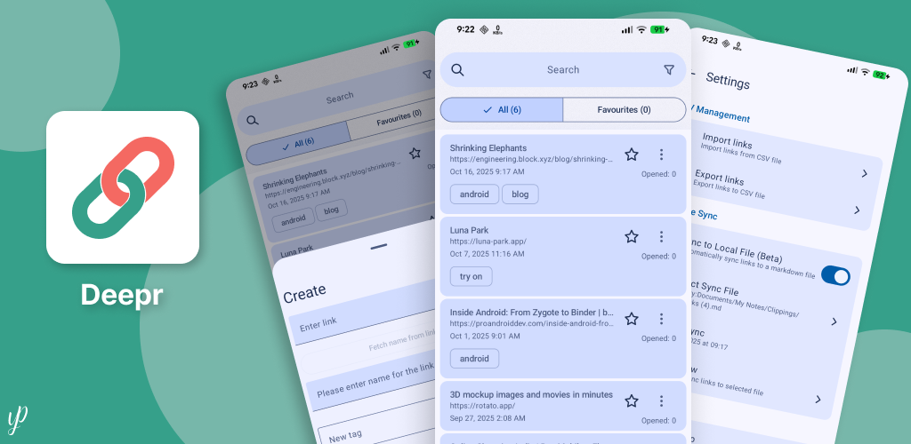

# Deepr 🔗

> Deepr is a native Android application designed to streamline the management and testing of links.
> It provides a simple and efficient way to store, organize, and open links.

    

## 🎩 🪄 Features

- Search
- Sort
- Open Counter
- Home Screen Shortcuts
- Import/Export links
- QR Code support: Generate and scan
- Organize links by tags
- Manage multiple profiles. When the user is inside a profile list of links, clicking the Profile icon at the bottom bar or using the device back button will send them back to the profiles selection grid.
- Save link by sharing from other app (eg: chrome, etc.)
- **Silent save option:** Save links from share sheet without opening the app
- Save links to markdown file in local storage. (can be used for obsidian)
- **Local network server:** Access and manage links from other devices on the same network

### Build Variant specific features

| Feature                           | Github Release | F-droid | Play Store | Pro Version on Play Store |
|-----------------------------------|----------------|---------|------------|-----------|
| Firebase Analytics                | ❌              | ❌       | ✅          | ✅  |
| Google Drive Backup | ❌              | ❌       | ❌         | ✅  |
| Profile speicific themes | ❌              | ❌       | ❌          | ✅  |

## 🏗️ Tech Stack

The application is built using modern Android development practices and libraries:

- **UI:** Jetpack Compose
- **Navigation:** Jetpack Compose Navigation 3
- **ViewModel:** Android ViewModel
- **Database:** SQLDelight
- **Dependency Injection:** Koin
- **Asynchronous Operations:** Kotlin Coroutines
- **HTTP Client & Server:** Ktor

## 📲 Download

You can download from any of the sources mentioned below.  
All these sources supports cross platform app updates. for eg: if you've installed app from F-Droid
then you can update the app from any of the sources.

- Github Release : [Download](https://github.com/yogeshpaliyal/Deepr/releases/latest)
- F-Droid : [Download](https://f-droid.org/packages/com.yogeshpaliyal.deepr/)
- Play Store: [Download](https://play.google.com/store/apps/details?id=com.yogeshpaliyal.deepr)
- Play Store (All features unlocked) : [Download](https://play.google.com/store/apps/details?id=com.yogeshpaliyal.deepr.pro)

## Special Thanks To

- [ARME](https://github.com/ALE-ARME) : For the unconditional commitment to quality assurance.
  

## Language  
  
Want to contribute to translations? [Contribute](https://hosted.weblate.org/engage/deepr/)

## Star History

<a href="https://www.star-history.com/#yogeshpaliyal/Deepr&type=date&legend=bottom-right">
 <picture>
   <source media="(prefers-color-scheme: dark)" srcset="https://api.star-history.com/svg?repos=yogeshpaliyal/Deepr&type=date&theme=dark&legend=bottom-right" />
   <source media="(prefers-color-scheme: light)" srcset="https://api.star-history.com/svg?repos=yogeshpaliyal/Deepr&type=date&legend=bottom-right" />
   
 </picture>
</a>

---

  <strong>Made with ❤️ using Android & Jetpack Compose</strong>
   
  Star ⭐ this repository if you find it helpful!

